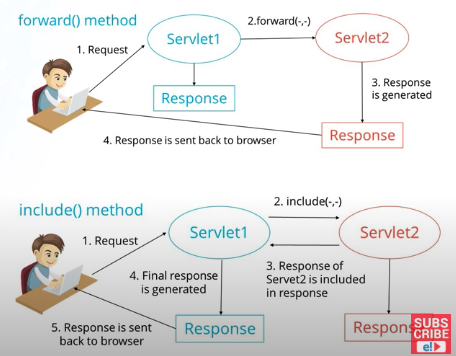

# Java Interview Questions

## 1. Basic Java Questions

### 1.1 JDK, JRE, JVM

- JVM: abstract machine. It executes the bytecode and converts it to machine code.
- JRE: Java Runtime Environment. It's a runtime environment that implements JVM and provides all libraries, classes and other files that JVM uses at run time. 
- JDK: Java Development Kit. It provides the environment to **develop and execute the program**. It includes two things:
  - Development Tools (java, javac)
  - JRE

### 1.2 Synchronization?

When we have multiple threads trying to access the same resource, we implement synchronization to keep all concurrent threads in execution to be in sync.

### 1.3 Process and Thread

Process is running instance of program over the operating system, and a thread like main thread is running within the process. 

Concurrent programming: A particular task on the main thread is taking longer time to execute, the other tasks after the task will be blocked. We can bring down one more thread, offload the heavier task over the main thread to the user thread


### 1.4. Wrapper Class

Wrapper class converts primitives to references. You can follow OOP, you can **Pass By Reference** 

```java
public static void main(String[] args){
	int i = 10; // single value container. only contains one value
  Integer iRef = new Integer(i); // boxed (constructing the object)
  int j = iRef.intvalue(); // unboxed (extract the value from Object)
  Integer kRef = i; // AutoBoxing (Integer kRef = new Integer(i))
  int l = kRef; // AutoUnboxing
  
}
```

### 1.5. Final, Finally, Finalize

- final: It's used to apply restrictions on variables, methods and classes
  - variables can't be changed
  - methods can't be overridden
  - classes can't be inherited
- finally: It's used to place important code. It's executed whether the exceptionis handled or not. `e.g. try -> finally; catch -> finally`
- finalize: It's a destructor. It's used to perform clean up processing just before object is garbage collected.

```java
class FinalizeDemo{
	protected void finalize() throws Throwable{
		System.out.println("Obj finalized...")
	}
}
.... main(){
  FinilizeDemo fdRef = new FinalizeDemo();
  fdRef = null;
	System.gc();
}

```

### 1.6 StringBuffer and StringBuilder

Strings are immutable, while StringBuffer and StringBuilder are mutable

- StringBuffer operations are thread-safe and synchronized where StringBuilder operations are not thread-safe
- StringBuffer is to be used when multiple threads are working on the same String and StringBuilder in the single threaded environment
- StringBuilder performance is faster than String Buffer because of no overhead of synchronized

### 1.7 Stack and Heap

- Stack is the memory set aside as scratch space for a thread of execution. When a function is called, a block is reserved on the top of the stack for local variables and some bookkeeping data. Stack memory stores primitive types and the addresses of objects.
- Heap is the memory set aside for dynamic allocation. Objects. 


### 1.8. ArrayList and Vector


### 1.9. HashMap and HashTable


### 1.10. equals() and == operator

```java
String a = new String("a");
String b = new String("b");

a == b // => compare references, so we normally use "==" to compare primitives and objects
a.equals(b) // check the equality of two objects
```

#### 1.11. Multithreading

*Concurrency* is the ability to run several programs or several parts of a program in parallel.

Multithreading is a Java feature that allows concurrent execution of two or more parts of a program for maximum utilization of CPU. Each part of such program is called a thread. So, threads are light-weight processes within a process.

Threads can be created by using two mechanisms :

1. Extending the Thread class
2. Implementing the Runnable Interface

**Thread Class vs Runnable Interface**

1. If we extend the Thread class, our class cannot extend any other class because Java doesn’t support multiple inheritance. But, if we implement the Runnable interface, our class can still extend other base classes.

2. We can achieve basic functionality of a thread by extending Thread class because it provides some inbuilt methods like yield(), interrupt() etc. that are not available in Runnable interface.

## 2. OOP

As the name suggests, Object-Oriented Programming or OOPs refers to languages that uses objects in programming. Object-oriented programming aims to implement real-world entities like inheritance, hiding, polymorphism etc in programming. The main aim of OOP is to bind together the data and the functions that operate on them so that no other part of the code can access this data except that function.

There are FOUR main concepts of OOP in Java: abstraction, encapsulation, inheritance and polymorphism

### 2.1. Abstraction: Abstract classes and Interfaces

Data Abstraction is the property by virtue of which only the essential details are displayed to the user.The trivial or the non-essentials units are not displayed to the user. Ex: A car is viewed as a car rather than its individual components.

Data Abstraction may also be defined as the process of identifying only the required characteristics of an object ignoring the irrelevant details. The properties and behaviours of an object differentiate it from other objects of similar type and also help in classifying/grouping the objects.

Consider a real-life example of a man driving a car. The man only knows that pressing the accelerators will increase the speed of car or applying brakes will stop the car but he does not know about how on pressing the accelerator the speed is actually increasing, he does not know about the inner mechanism of the car or the implementation of accelerator, brakes etc in the car. This is what abstraction is.

In java, abstraction is achieved by [interfaces](https://www.geeksforgeeks.org/interfaces-in-java/) and [abstract classes](https://www.geeksforgeeks.org/abstract-classes-in-java/). We can achieve 100% abstraction using interfaces.


```java
abstract class Shape{
  Shape(){
    System.out.println("Shape");
  }
  abstract void draw();
}

class Circle extends Shape{
  void draw(){
    //overriding
    System.out.println("Circle");
  }
}

class Rectangle extends Shape{
  void draw(){
    System.out.println("Rectangle");
  }
}

public static void main(String[] args){
  Shape s;
  s = new Circle();
  s.draw(); // draw a circle
  
  s = new Rectangle();
  s.draw(); // draw a rectangle
}
```

```java
interface Shape{
  void draw();
}

class Circle implements Shape{
  void draw(){
    //overriding
    System.out.println("Circle");
  }
}

class Rectangle implements Shape{
  void draw(){
    System.out.println("Rectangle");
  }
}

public static void main(String[] args){
  Shape s;
  s = new Circle();
  s.draw(); // draw a circle
  
  s = new Rectangle();
  s.draw(); // draw a rectangle
}
```

Abstract class is like the parent, while interface is like the rule. You inherit from the parent, and you need to follow the rules.

### 2.2 Run-time Polymorphism

Polymorphism: It's a characteristic of being able to assign a different meaning or usage to something in different contexts.

Run-time polymorphism: It's a process in which a call to an overridden method is resolved at runtime rather than at compile-time.

In this process, an overridden method is called through the reference variable of a superclass. 

### 2.3 Method Overriding and Method Overloading


### 2.4. Can you override a private or static method?

- Private methods cannot be overridden because they are not visible from any other class.
- For static method: If you create a similar method with same return type and same method arguments in child class then it will hide the super class method. This is known as method hiding. It's DIFFERENT from method overriding. BTW, Static methods should be called on CLASS.

### 2.5. Multiple inheritance

Multiple inheritance: one class extends from multiple classes. It is NOT SUPPORTED in Java.

### 2.6. Encapsulation

Encapsulation in Java is a mechanism of wrapping the data (variables) and code acting on the data (methods) together as a single unit. In encapsulation, the variables of a class will be hidden from other classes, and can be accessed only through the methods of their current class. Therefore, it is also known as **data hiding**.

To achieve encapsulation in Java −

- Declare the variables of a class as private.

- Provide public setter and getter methods to modify and view the variables values.

- ```java
  /* File name : EncapTest.java */
  public class EncapTest {
     private String name;
     private String idNum;
     private int age;
  
     public int getAge() {
        return age;
     }
  
     public String getName() {
        return name;
     }
  
     public String getIdNum() {
        return idNum;
     }
  
     public void setAge( int newAge) {
        age = newAge;
     }
  
     public void setName(String newName) {
        name = newName;
     }
  
     public void setIdNum( String newId) {
        idNum = newId;
     }
  }
  ```


#### 2.7. Private, Public, Protected, Default

You must have seen public, private and protected keywords while practising java programs, these are called access modifiers. An access modifier restricts the access of a class, constructor, data member and method in another class. 

```
-----------+-------+---------+--------------+--------------+--------
            | Class | Package | Subclass     | Subclass     |Outside|
            |       |         |(same package)|(diff package)|Class  |
————————————+———————+—————————+——————————----+—————————----—+————————
public      | Yes   |  Yes    |    Yes       |    Yes       |   Yes |    
————————————+———————+—————————+—————————----—+—————————----—+————————
protected   | Yes   |  Yes    |    Yes       |    Yes       |   No  |    
————————————+———————+—————————+————————----——+————————----——+————————
default     | Yes   |  Yes    |    Yes       |    No        |   No  |
————————————+———————+—————————+————————----——+————————----——+————————
private     | Yes   |  No     |    No        |    No        |   No  |
------------+-------+---------+--------------+--------------+--------
```


## 3. Servlets

### 3.1. What is Servlet?

- Java Servlet is server side technologies to extend the capability of web server by providing support for dynamic response and data persistence.
- The javax.servlet and javax.servlet.http packages provide interfaces and classes for writing our own servlets.
- All servlets must implement the javax.servlet.Servlet interface, which defines servlet lifecycle methods
- As most web applications are accessed using HTTP protocal, we mostly extrend HttpServlet class

### 3.2. Get and Post method


### 3.3. Session Management in servlets?

- Session is a conversational state between client and server and it can consists of multiple request and response between client and server

- Since HTTP and Web Server both are stateless, the only way to maintain a session is when some unique information aobut the session(session id) is passed between server and client in every request and response.

  

### 3.4. ServletContext and ServletConfig


### 3.5. Life-cycle of servlet

loading -> instatiating -> initializing -> request -> destruction

3 API: init, service, destroy

### 3.6. Request Dispatcher

RequestDispatcher interface is used to forward the request to another resource that can be HTML, JSP or another servlet in the same application

We can also use this to include the content of another resource to the response.

### 3.7. Cookies

Cookies are text data sent by the server to the client and they are saved at the client's local machine.

- Servlet Cookie API: javax.servlet.http.Cookie `e.g. getCookies(); addCookie(Cookie c)` 

## 4. JDBC - Java Database Connectivity

### 4.1. JDBC Driver

JDBC Driver is a software compoennt that enables java applications to interact with the database. It uses JDBC API.


### 4.2. What are the steps to connect to the database in java?

1. Registering the driver
2. Creating connection
3. Creating statement
4. Executing queries
5. Closing connection


### 4.3. What is the difference between execute, executeQuery , executeUpdate?


## 5. Spring

### 5.1. Spring

- Spring is the most popular application development framework for enterprise Java.
- The framework's core features can be used by any Java application, but there are extensions for applications on top of the Java EE platform.
- Spring is essentially a lightweight, integrated framework that can be used for developing enterprise applications in Java

### 5.2. What is BEAN?

A bean is an object that is instantiated, assembled and managed by a Spring IoC container.

5 scopes:

1. Singleton: single object, by default
2. Prototype: eveyrtime a new object
3. Request: one object for all request
4. Session: one object for session
5. Global session: one object for global-session

### 5.3. How to add BEAN to a Spring application?


Then add property as key value pair under each bean.

### 5.4. Difference between constructor injection and setter injection?

Example: If we create a new address object in the constructor of employee class. We need to create a new address object everytime we create a new employee class. This is HIGH COUPLING, we need it to be LOW COUPLING, so we can take out the address object from the constructor and create a setter method to set the address variable by passing an address object 


## 6. Hibernate

### 6.1. What is Hibernate?

It is a **java framework** which is used to develop persistence logic. Persistence logic means to store and process the data for long use. 

More precisely Hibernate is an open-source, non-invasive, light-weight java ORM(Object-relational mapping) framework to develop objects which are independent of the database software and make independent persistence logic in all JAVA, JEE.

### 6.2. What are the advantages of Hibernate over JDBC?

https://www.geeksforgeeks.org/introduction-to-hibernate-framework/


Also, it's very inefficient to switch to another databse using JDBC, while using Hibernation, we just need to change the parameter of the configuration file.